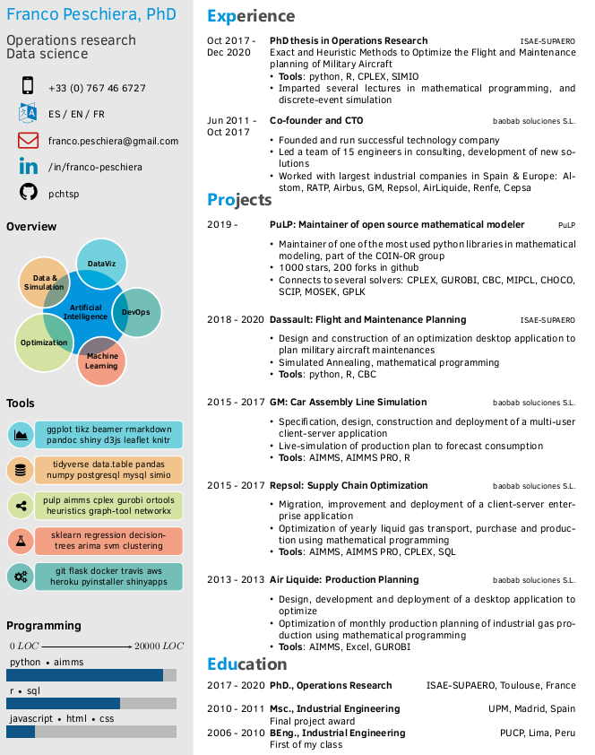

# LaTeX resume template

This is the template I use for my own resume. I forked it from Harsh Gadgil's repository and mixed it with Jonathan Ohayon's fork : 

1. [Harsh Gadgil's resume template](https://github.com/opensorceror/Data-Engineer-Resume-LaTeX)
2. [Jonathan Ohayon](https://github.com/Johayon/Data-Scientist-Resume-LaTeX)



I'm leaving the original instructions below. 

## Installating pre-requisites (Windows)

1. Install [MiKTeX](https://miktex.org/howto/install-miktex), a TeX distribution for Windows that includes a large number of major packages.

2. Install an editor to edit and compile LaTeX documents. I recommend [TeXstudio](http://www.texstudio.org/) or [Texmaker](http://www.xm1math.net/texmaker/).

Once both the distribution and editor are installed, clone this repository using `git clone` and open the template.tex file in your editor. You're good to go!

## Installation on Linux (Ubuntu)

1. Install texlive and some extras
```
sudo apt-get install texlive texlive-xetex texlive-fonts-extra
```

2. Install an editor
```
sudo apt install texworks
```

------

In my case, using Ubuntu, I had to use `xelatex` (via the [LatexTools](https://latextools.readthedocs.io/en/latest/) plugin for [SublimeText3](https://www.sublimetext.com/3)) to be able to compile it without errors. `pdflatex` did not work.


## License

```
Copyright 2016 Harshavardhan Gadgil

Licensed under the Apache License, Version 2.0 (the "License");
you may not use this file except in compliance with the License.
You may obtain a copy of the License at

   http://www.apache.org/licenses/LICENSE-2.0

Unless required by applicable law or agreed to in writing, software
distributed under the License is distributed on an "AS IS" BASIS,
WITHOUT WARRANTIES OR CONDITIONS OF ANY KIND, either express or implied.
See the License for the specific language governing permissions and
limitations under the License.
```

